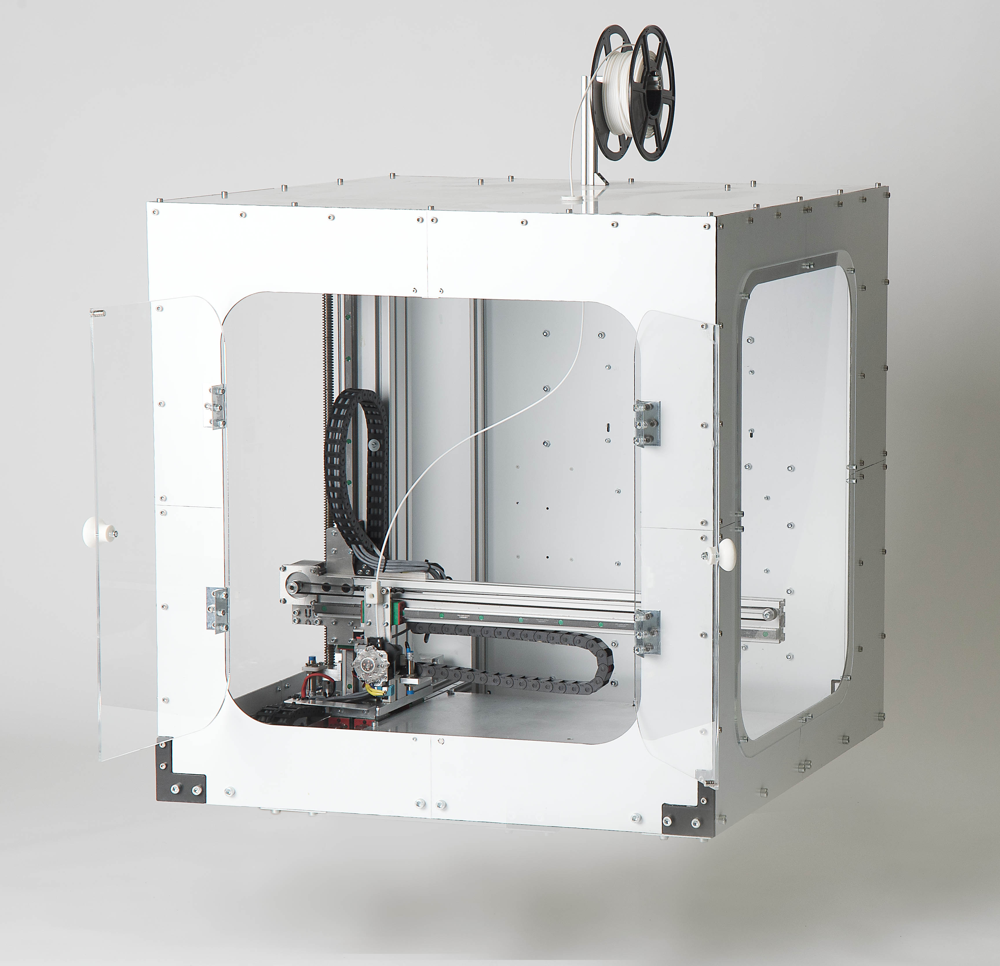

<h1 style=align="center">MidFDM</h1>

<i>Medium Size Open Source 3D Printer

</i>

MidFDM specifications
--

- printing volume: 500x480x470mm Y-X-Z
- extruter: E3D Titan Aero 24V with direct drive
- filament: 2.85mm
- building platform: 6mm aluminum plate
- bed heaters: 4 x 200W silicon AC heaters
- actuators: 10mm GT2 Belt for X and Y, 16mm leadscrew
- motors: Y Nema 24 4Nm, X Nema 23 1.26 Nm, Z, Nema 23 1.26Nm
- linear guides: Hiwin HGR15 15mm
- frame: bosch aluminum profiles and custom parts from 12mm flat aluminum
- housing: aluminum composite and acrylic
- inductive Z min endstop
- autoleveling with inductive probe

Author
--

Rhine-Waal University of Applied Sciences

https://www.hochschule-rhein-waal.de/en

License
--

MidFDM and all the work in this repository is released under the following open source license:

CERN Open Hardware Licence - Weakly Reciprocal, CERN-OHL-W